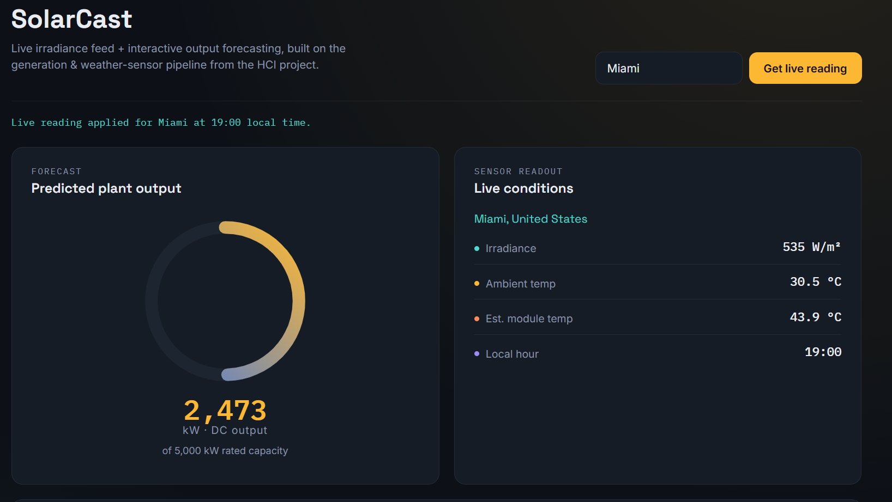

# ☀️ Solar Power Forecasting Dashboard

An interactive Human Computer Interaction (HCI) dashboard for forecasting solar power generation using Machine Learning and live weather data.

---

# 🚀 Live Demo

### 🌐 Website

https://usmankahloon076-web.github.io/Solar-Power-Forecasting/

---

# 📸 Dashboard Preview



---

# 📖 Project Overview

This project predicts solar power generation using weather sensor data and provides an interactive dashboard that allows users to visualize expected plant output under different environmental conditions.

The dashboard demonstrates Human Computer Interaction principles through:

- Live weather retrieval
- Interactive prediction gauge
- Direct manipulation sliders
- Instant visual feedback
- Responsive user interface

---

# ✨ Features

- ☀️ Solar Power Prediction
- 🌡 Temperature Derating
- 📈 Interactive Gauge
- 🌍 Live Weather API
- 🎛 What-if Simulator
- 📊 Daily Generation Curve
- 📱 Responsive Design

---

# 🛠 Technologies Used

## Programming Languages

- Python
- HTML5
- CSS3
- JavaScript

## Machine Learning

- Scikit-learn
- Random Forest Regressor

## Data Analysis

- Pandas
- NumPy

## Visualization

- Matplotlib

## Weather API

- Open-Meteo API

---

# 📂 Repository Structure

```
Solar-Power-Forecasting

│── index.html
│── ProjectNotebook.ipynb
│── Plant_1_Generation_Data.csv
│── Plant_1_Weather_Sensor_Data.csv
│── Dashboard.png
│── README.md
│── requirements.txt
```

---

# 🎯 Objective

Develop a machine learning-based system capable of estimating solar power generation while providing an intuitive and user-friendly interface for monitoring plant performance.

---

# 🔮 Future Improvements

- Deploy actual trained Random Forest model
- Flask backend
- Streamlit version
- Historical prediction graphs
- Multiple solar plants
- User authentication
- Export predictions to PDF

---

# 👨‍💻 Author

**Usman Kahloon**


---

⭐ If you found this project interesting, consider giving it a star.
